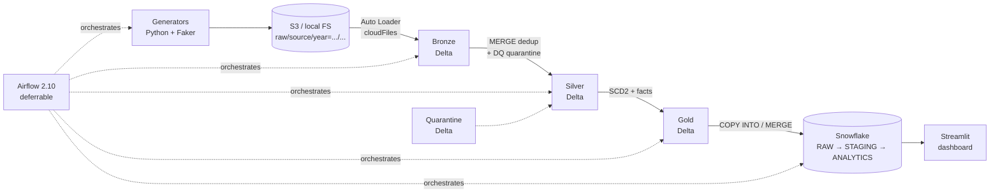

# Ecommerce Lakehouse Platform

End-to-end data platform for ecommerce analytics. Synthetic event generation
flows through S3 → Databricks (medallion architecture) → Snowflake → Streamlit
dashboard, with Airflow orchestration and Terraform-managed AWS infrastructure.

This is a portfolio-style project demonstrating production-grade lakehouse
patterns: schema evolution via Auto Loader, MERGE-based deduplication,
sessionization windows, SCD Type 2 dimensions, transactional + accumulating
snapshot facts, deferrable orchestration, and CI-gated quality checks.

## Status

Built in vertical slices — one source flowing end-to-end before adding the
next. See [`PLAN.md`](PLAN.md) for the slice plan.

| Slice | Scope | Status |
|-------|-------|--------|
| 0 | Project scaffolding, CI lint, layered configs | ✅ done |
| 1 | **Orders** end-to-end: generator → S3 → Bronze → Silver → Gold → Snowflake → Airflow → tests | ✅ done |
| 2 | **Customers + Products** (SCD2 dimensions, PIT-correct surrogate joins) | ✅ done |
| 3 | **Clickstream** + hourly DAG + sessionization + Snowpipe/Streams/Tasks + Dataset triggering | ✅ done |
| 4 | **Currency rates** + customer_ltv mart + wishlist factless fact + MV | ✅ done |
| 5 | **Infra hardening**: Terraform (7 modules), validator Lambda (Container Image), quarantine-replay Step Functions, IAM least-privilege, Snowflake resource monitors, weekly maintenance DAG + cost report | ✅ done |
| 6 | Streamlit + CI/CD deploy + full docs | ⏳ pending |

## Architecture



## Tech stack

| Layer | Tool | Version |
|-------|------|---------|
| Language | CPython | 3.11 |
| Generators | Faker, pandas, pyarrow | latest stable |
| Lake format | Delta Lake | 3.2.x |
| Compute | Databricks Runtime / Apache Spark | 15.x LTS / 3.5.x |
| Warehouse | Snowflake | account-managed |
| Orchestrator | Apache Airflow | 2.10.x |
| IaC | Terraform | 1.7+ |
| Dashboard | Streamlit | 1.36+ |
| CI | GitHub Actions | — |
| Lint | ruff, black, sqlfluff | per `pyproject.toml` / `.sqlfluff` |
| Test | pytest, chispa | per `pyproject.toml` |

## Repository layout

```
.
├── orchestration/         Airflow DAGs (named non-"airflow" to avoid
│   ├── dags/              shadowing the airflow PyPI package on sys.path)
│   └── tests/
├── config/                Layered YAML configs (base + per-env)
├── databricks/
│   ├── libs/              Importable Python modules (shared transform logic)
│   ├── notebooks/         {bronze,silver,gold}/ notebooks
│   └── tests/             pytest + chispa tests for libs
├── data/                  Local dev data (gitignored except mock/)
├── docs/                  Architecture + runbook
├── generators/            Source data generators
├── infrastructure/        Terraform (Slice 5)
├── snowflake/             DDL, DML, SQL tests
├── streamlit_app/         Dashboard (Slice 6)
├── tests/                 Generator tests + cross-cutting tests
├── conftest.py            Root conftest: sys.path + eager imports
├── PLAN.md                Implementation plan
└── README.md              This file
```

## Setup (local dev)

Requires Python 3.11.

```bash
python -m venv .venv
source .venv/bin/activate
pip install --upgrade pip
pip install -e ".[dev]"          # generators + lint + test
# Optional extras as you exercise each layer:
pip install -e ".[spark]"        # Databricks libs unit tests
pip install -e ".[airflow]"      # DAG import validation
pip install -e ".[streamlit]"    # dashboard
```

Set the dev env vars:

```bash
export PROJECT_ROOT="$(pwd)"
export LAKEHOUSE_ENV=dev
```

## Running

### Generators

```bash
python -m generators.orders --start-date 2025-05-01 --end-date 2025-05-07
```

Outputs land under `data/raw/orders/year=YYYY/month=MM/day=DD/orders.parquet`.

### Unit tests

```bash
pytest                                  # all tests
pytest tests/generators                 # just generator tests
pytest -m "not spark"                   # skip Spark-dependent tests
```

### Airflow DAG validation

```bash
pip install -e ".[airflow]"
export AIRFLOW_HOME="$(pwd)/.airflow"
airflow db migrate
airflow dags list-import-errors          # must be empty
airflow dags test daily_batch_pipeline 2025-05-01
```

The DAG-import tests in `orchestration/tests/test_dag_imports.py` cover
the same ground without needing an initialised Airflow metadata DB:

```bash
pytest orchestration/tests -q
```

### Local end-to-end (Slice 1)

See [`docs/runbook.md`](docs/runbook.md) → "Running end-to-end locally".

### Cloud end-to-end

See [`docs/runbook.md`](docs/runbook.md) → "Running end-to-end in cloud".
Requires AWS, Databricks, and Snowflake accounts with credentials in
the appropriate secret stores.

## Configuration

`config/base.yaml` holds shared defaults; `config/<env>.yaml` layers
environment-specific overrides on top. `${VAR_NAME}` references are
resolved against the process environment at load time.

```python
from libs.config import load_config
cfg = load_config(env="dev")
```

Secrets (Databricks PAT, Snowflake creds) never live in config files —
they're sourced from environment variables in dev and AWS Secrets
Manager in prod via Airflow's secrets backend.

## Cost estimates

Per-component cost notes appear in `docs/architecture.md` as each
slice lands. Headline assumptions:

- S3 raw stays "Standard" for 90 days, then transitions to Glacier
  Flexible Retrieval (lifecycle policy in `infrastructure/terraform/`).
- Databricks jobs use job clusters (not all-purpose) for spot-priced
  ephemeral compute.
- Snowflake serving uses an XS warehouse with 60s auto-suspend; per-
  warehouse + account-level resource monitors cap spend with NOTIFY
  at 75%/90% and SUSPEND at 100% (see
  `snowflake/ddl/01_resource_monitors.sql`).
- Quarantine review uses Step Functions `waitForTaskToken` for the
  7-day operator-decision window — zero compute cost while waiting,
  vs ~$X/hour for an Airflow worker slot held open over the same span.

## Infrastructure

Slice 5 added a Terraform tree under `infrastructure/terraform/`:

```
infrastructure/terraform/
├── main.tf              # top-level wiring; thin
├── variables.tf         # env, bucket name, retention, etc.
├── environments/        # dev.tfvars / prod.tfvars
└── modules/
    ├── s3/              # bucket + KMS + lifecycle
    ├── sns/             # alerts topic + email subscription
    ├── cloudwatch/      # log groups + metric alarms + dashboard
    ├── secrets/         # 4 placeholder secrets (databricks, snowflake, exchangerate, airflow)
    ├── iam/             # 5 least-privilege roles + walkthrough README
    ├── lambda_validator/  # SQS + DLQ + Container Image Lambda
    └── step_functions/  # ASL JSON + quarantine_helper Lambda
```

The state machine implements a three-branch human-in-the-loop
quarantine workflow (replay / discard / fix-and-replay) — see
`infrastructure/terraform/modules/step_functions/README.md` for the
scenario walkthrough and the why-not-Airflow cost comparison.

## Documentation

- [`PLAN.md`](PLAN.md) — vertical slice plan and progress
- [`docs/architecture.md`](docs/architecture.md) — decisions and tradeoffs
- [`docs/runbook.md`](docs/runbook.md) — failure modes, backfill, replay
