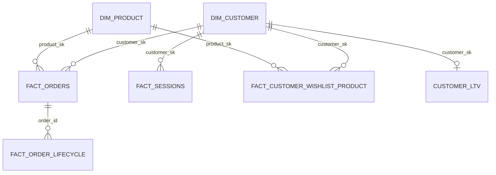

# Data model

The Snowflake `ANALYTICS` schema is shaped as a star schema with three
dimension tables and four fact tables, plus one factless fact and one
materialized view. Each entity is documented below: grain, columns,
keys, SCD strategy, source of truth, downstream consumers.

The Databricks `gold` Delta tables hold the same shapes — Snowflake is
a 1:1 mirror loaded via COPY INTO + MERGE (see
[`runbook.md`](runbook.md)). Where the two diverge, it's flagged
explicitly.

## Star schema overview

Reading the cardinalities: customers have many orders, products are on
many orders, sessions are anonymous or authenticated (so customer_sk is
nullable on `fact_sessions`), and the LTV mart is one row per
customer.

## Dimensions

### `dim_customer` (SCD Type 2)

| Column | Type | Notes |
|---|---|---|
| `customer_sk` | STRING | Surrogate key. `sha256(customer_id \|\| effective_from_iso)` so a new SCD2 version produces a new sk. |
| `customer_id` | STRING | Natural key from the source. |
| `email` / `address` / `name` / `phone` | STRING | Tracked attributes. Any change → new version. |
| `effective_from` | TIMESTAMP | Start of this version's validity window. |
| `effective_to` | TIMESTAMP | End of validity. NULL → currently active. |
| `is_current` | BOOLEAN | Index-friendly current-version flag. |
| `_loaded_at` | TIMESTAMP | When this row was materialized in Gold. |

- **Grain:** one row per (customer_id, version)
- **SCD strategy:** Type 2 with non-overlapping `[effective_from, effective_to)` windows. Enforced by `test_dim_customer_no_overlapping_versions.sql`.
- **Updates:** Silver MERGE detects column drift, closes the prior version, inserts a new one. See `databricks/libs/scd2.py`.
- **PIT joins:** `fact_orders` binds to `dim_customer` at order time via `effective_from <= order_ts < COALESCE(effective_to, '9999-12-31')`.

### `dim_product` (SCD Type 2)

Same shape as `dim_customer`. Tracked attributes: `product_name`,
`category`, `price`, `sku`. Category changes are the most common
source of new versions (vendor reorganizes their catalog).

### `dim_session` — not materialized

Session attributes (`session_id`, `device`, `user_agent`, `entry_page`)
live on `fact_sessions` directly. Sessions are short-lived and not
queried independently of their fact, so a separate dim wouldn't pay
for itself. Documented here so a future reader doesn't wonder where
the dim went.

## Facts

### `fact_orders` (transactional)

| Column | Type | Notes |
|---|---|---|
| `order_id` | STRING | Natural key — one row per order. |
| `customer_sk` | STRING | PIT-bound to `dim_customer` at `created_at`. |
| `product_sk` | STRING | PIT-bound to `dim_product` at `created_at`. |
| `category` | STRING | Denormalised onto the fact at PIT (Slice 4 MV workaround). |
| `quantity` / `price` | INT / DECIMAL | Single-line orders. |
| `status` | STRING | placed / paid / shipped / delivered / cancelled |
| `currency_code` | STRING | Source currency at order time. |
| `revenue_usd` | DECIMAL | Pre-computed via `fact_orders.price * fact_orders.quantity * currency_rate(order_ts)`. |
| `created_at` / `updated_at` | TIMESTAMP | Source timestamps; drive the MERGE predicate. |
| `_source_file` / `_batch_id` / `_loaded_at` | STRING / STRING / TIMESTAMP | Provenance. |

- **Grain:** one row per order_id
- **Updates:** MERGE WHEN MATCHED AND `s.updated_at > t.updated_at` THEN UPDATE. Late-arriving "placed" can't erase later "paid" milestones (Slice 1 design decision).
- **PIT correctness:** Silver-to-Gold joins use SCD2 windows on both dims. Daily DAG enforces the dim → fact ordering so the surrogate binding sees fresh dim versions.

### `fact_order_lifecycle` (accumulating snapshot)

One row per order_id, with milestone timestamps as columns rather than
rows:

| Column | Notes |
|---|---|
| `order_id` | PK |
| `placed_at` / `paid_at` / `shipped_at` / `delivered_at` / `cancelled_at` | One nullable timestamp per milestone. |
| `days_placed_to_paid` / `days_placed_to_shipped` / `days_placed_to_delivered` | Pre-computed deltas. |
| `terminal_status` | The order's current state — denormalised from `fact_orders` for query convenience. |

- **Grain:** one row per order_id (same as `fact_orders` — they're 1:1)
- **Why separate from `fact_orders`:** querying "median days-to-delivery this month" is a per-order aggregation; querying "revenue by category this month" is a per-line aggregation. Different access patterns. Both refer to `fact_orders` rows but the rolled-up shape is much easier to reason about on the accumulating-snapshot fact.

### `fact_sessions` (transactional, no surrogate dim)

| Column | Notes |
|---|---|
| `session_id` | PK. Synthetic — `min(event_id) over (partition by raw_session_id)`. |
| `customer_sk` | Nullable — anonymous sessions exist. |
| `start_ts` / `end_ts` / `duration_s` | Session window via gap-and-island sessionization (30-min inactivity gap). |
| `event_count` / `page_view_count` / `purchase_count` | Aggregates. |
| `entry_page` / `exit_page` | First / last `page_url` in the session. |
| `device` / `user_agent` | First seen in the session — see the "shared device" caveat in the runbook. |

- **Grain:** one row per session_id
- **Source:** Slice 3's hourly clickstream pipeline; sessionization in `databricks/libs/sessionize.py`.
- **Why a fact:** even though sessions are about *behaviour*, they have measurable additive metrics (counts, duration) — that's a fact, not a dim.

### `fact_customer_wishlist_product` (factless fact)

| Column | Notes |
|---|---|
| `customer_sk` | PIT-bound at `added_at` |
| `product_sk` | PIT-bound at `added_at` |
| `added_at` | Event timestamp |
| `removed_at` | NULL until the customer removes. |
| `event_action` | added / removed |
| `_loaded_at` | Provenance |

- **Grain:** one row per (customer, product, added_at) event — **per event**, not per relationship. Re-adds (same customer adding the same product after removing it) carry signal worth preserving.
- **Trade-off:** "is this relationship currently active?" requires a `DISTINCT ON (customer_sk, product_sk) ORDER BY added_at DESC` query rather than a simple `WHERE removed_at IS NULL`. The canonical Kimball factless-fact ergonomic.
- **Why factless:** there's no measure to add up. The interesting question is "did this happen" — useful aggregates ("most-wishlisted products this week") count rows, not sum measures.

## Pre-computed mart

### `customer_ltv` (Databricks Gold table, replicated to Snowflake)

| Column | Notes |
|---|---|
| `customer_sk` | One row per current customer version |
| `customer_id` | Natural key for joining to ad-hoc per-customer queries |
| `lifetime_orders` | COUNT(*) over `fact_orders` where status != 'cancelled' |
| `lifetime_revenue_usd` | SUM(revenue_usd) over the same filter |
| `avg_order_value_usd` | DERIVED |
| `first_order_at` / `last_order_at` | MIN / MAX of `placed_at` |
| `days_since_last_order` | Computed at load time |
| `avg_days_between_orders` | LAG window over the per-customer order timeline |
| `predicted_churn_flag` | 90-day-no-order + multi-prior-orders heuristic. *Placeholder for the Slice 6 churn-prediction-model widget; documented as not a real model in `docs/runbook.md`.* |

- **Grain:** one row per current `customer_sk`
- **Why not a Snowflake MV:** the LAG window for `avg_days_between_orders` isn't allowed in single-table Snowflake MVs.
- **Refresh:** atomic rename-swap on a side table (`customer_ltv_new` → `customer_ltv`) so dashboards never see a half-written mart.

## Materialized view (Snowflake)

### `mv_daily_revenue_by_category`

| Column | Notes |
|---|---|
| `revenue_date` | DATE_TRUNC('day', placed_at) |
| `category` | PIT-denormalised on `fact_orders` |
| `revenue_usd` | SUM |
| `order_count` | COUNT |

- **Grain:** one row per (revenue_date, category)
- **Why an MV:** the dashboard "revenue trend by category" widget queries this every page load. Snowflake auto-refreshes the MV on base-table writes, keeping page latency under a second.
- **Snowflake MV restrictions:** single-table only, no joins. The `category` is denormalised onto `fact_orders` at PIT (Slice 4 design decision, see `snowflake/ddl/mv_evidence.md`) so the MV doesn't need to join `dim_product`.

## Reference tables

### `currency_rates`

| Column | Notes |
|---|---|
| `rate_date` | Date the rate is valid for |
| `currency_code` | ISO 4217 |
| `rate_to_usd` | Multiplier to convert |
| `_source` | `'api'` (live exchangerate.host) or `'simulated'` (deterministic fallback) |
| `_fetched_at` | Provenance |

- **Grain:** one row per (rate_date, currency_code, _source). Late-day API recovery can overwrite the simulated fallback for the same day; the dedup precedence in Silver is `api` > `simulated`.
- **Observability:** the `_source` column drives the `dq_currency_freshness` DQ gate — > 50% simulated for today's rates is a hard fail.

## Surrogate key derivation

All `*_sk` columns are SHA-256 of:

- **Dimensions (SCD2):** `sha256(natural_key || '|' || effective_from_iso)`. New version → new sk.
- **Facts:** SHA-256 of the natural key alone (because the natural key IS the grain). E.g. `order_sk = sha256(order_id)`.

Trade-off vs an auto-incrementing INT:
- **+** Deterministic across clusters / re-runs — same input → same sk
- **+** No coordination — Silver and Gold can run on different clusters
- **−** 64 bytes vs INT8's 8 — Delta and Snowflake compress this away to ~6 bytes-per-row effective storage

See `databricks/libs/keys.py` for the implementation.

## Provenance columns on every Gold table

Every Gold and Snowflake table has:

- `_source_file` (STRING) — the raw/ S3 key the row originated from
- `_batch_id` (STRING) — the Airflow run's `emit_batch_id` task output
- `_loaded_at` (TIMESTAMP) — wall-clock load time

The dashboard's "Data freshness" widget reads `MAX(_loaded_at)` per
table. The runbook's backfill procedure uses `_batch_id` to filter
rows that need re-loading. The Slice 4 `_source` provenance column on
`currency_rates` is a row-level extension of the same idea.
