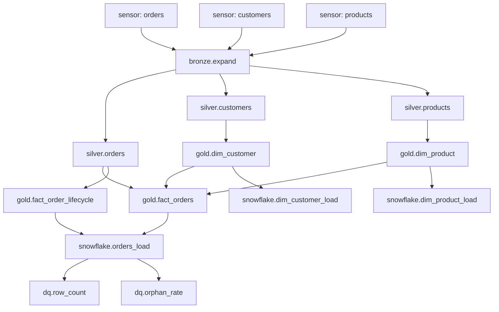

# Pipeline task-flow diagrams

Rendered task graphs for the Airflow DAGs in `orchestration/dags/`. GitHub
renders the Mermaid blocks below; the DAG source files link here rather than
embedding the diagrams, because a `.py` docstring never renders on GitHub and
the Sphinx `.. mermaid::` directive needs a docs build this repo doesn't have.

## `daily_batch_pipeline` — orders + customers + products

Schedule: 02:00 UTC daily · SLA: 4 hours end-to-end.

## `hourly_clickstream_pipeline` — clickstream sessionization

Schedule: @hourly · SLA: 15 minutes end-to-end.

The Snowpipe + Streams + Tasks pipeline downstream of S3 gold runs
autonomously in Snowflake — Airflow does not manage it (it's S3-event-driven
and time-driven within Snowflake). See
`snowflake/ddl/50_snowpipe_streams_tasks.sql` for the full Snowflake-side flow.
